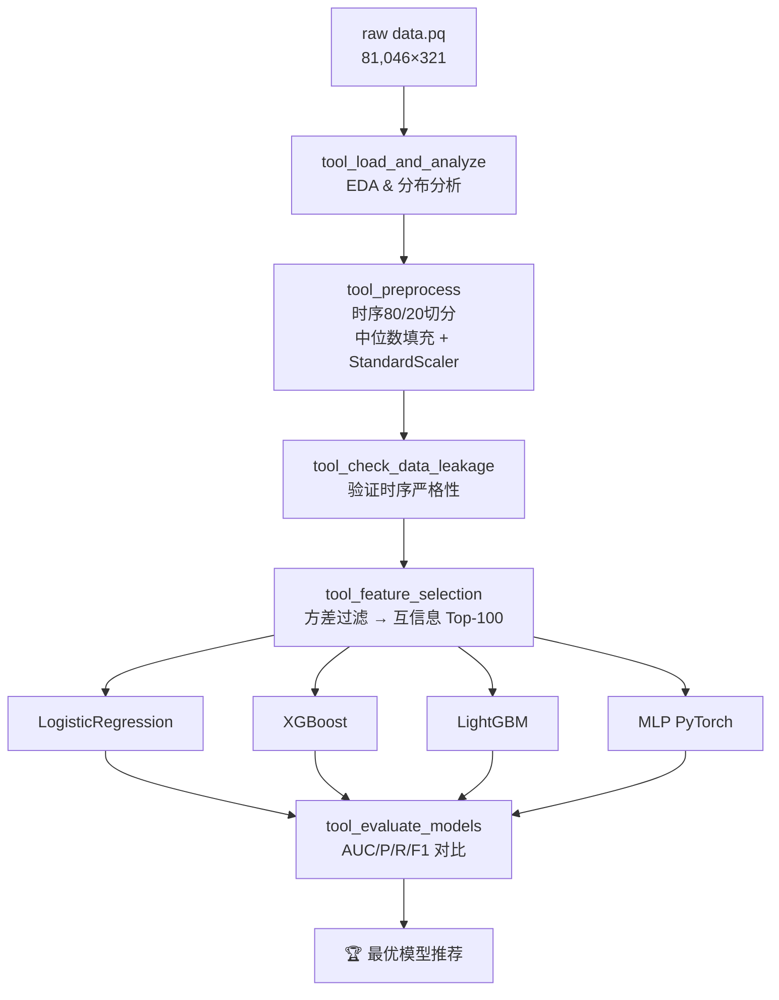

# Q2 · Agent 驱动的金融建模系统

> **方向 B — 自动化模型选择**  
> 使用 LangChain `@tool` + ReAct 模式构建端到端 Agent，实现数据探索 → 预处理 → 特征选择 → 多模型训练 → 自动评估 → 最优模型推荐的全流程自动化。

---

## 1. 系统架构

```
FinancialModelingAgent (ReAct Orchestrator)
│
├── Tool 1: tool_load_and_analyze      # 数据加载 & EDA
├── Tool 2: tool_preprocess            # 时序切分 + 归一化
├── Tool 3: tool_check_data_leakage    # 数据泄漏审计
├── Tool 4: tool_feature_selection     # 方差过滤 + 互信息
├── Tool 5: tool_train_all_models      # LR / XGBoost / LightGBM / MLP
└── Tool 6: tool_evaluate_models       # AUC / P / R / F1
```



---

## 2. LangChain Agent 设计

### 2.1 工具封装模式

每个工具使用 `@tool` 装饰器声明，输入/输出均为字符串，符合 LangChain Tool 协议：

```python
@tool
def tool_feature_selection(n_features: str) -> str:
    """从300个原始特征中，用方差过滤+互信息（MI）选出Top-N最重要特征"""
    n = int(n_features)
    ...
    return report_str
```

工具间通过模块级全局字典 `_STATE` 共享数据（等价于 Agent 的"工作记忆"）：

```python
_STATE: dict[str, Any] = {}
# 训练数据、模型对象、评估结果均存入 _STATE，跨工具调用共享
```

### 2.2 ReAct 链式调用（无 LLM API）

`FinancialModelingAgent` 以确定性方式模拟 ReAct 推理链，无需 OpenAI/Claude 等外部 API：

```
Thought: 原始300个特征维度太高，噪声较多。用互信息评分选Top-100。
Action:  tool_feature_selection('100')
Observation: 已从300特征中筛选出Top-100，X_train: (64836,100)

Thought: 特征压缩完成，现在训练4种模型。
Action:  tool_train_all_models('default')
Observation: LR(3.5s), XGB(3.9s), LGBM(0.6s), MLP(35.9s) 全部完成
...
```

---

## 3. 数据处理流程

| 步骤 | 方法 | 说明 |
|------|------|------|
| 加载 | `pd.read_parquet` | 81,046×321，Y1~Y12三值标签 |
| 目标变量 | `(Y1 == 1).astype(int)` | 三值→二值，正类≈14.5% |
| 时序切分 | 按 `trade_date` 排序后取前80% | 严格防止未来数据泄漏 |
| 缺失值填充 | 中位数（仅用训练集 fit） | 金融数据中位数比均值鲁棒 |
| 归一化 | `StandardScaler`（仅训练集 fit） | 避免测试集信息渗漏 |
| 特征选择 | 方差过滤(0.01) → MI Top-100 | 从300维降至100维 |

---

## 4. 模型设计

### 4.1 LogisticRegression（线性基线）
- `class_weight="balanced"` 处理类别不平衡
- `C=0.1` L2 正则化防过拟合

### 4.2 XGBoost
- `scale_pos_weight = neg/pos` 自动计算权重比
- `subsample=0.8, colsample_bytree=0.8` 随机化防过拟合
- `n_estimators=300, max_depth=5, learning_rate=0.05`

### 4.3 LightGBM
- 同 XGBoost 参数体系，训练速度最快（0.6s vs XGB 3.9s）
- `early_stopping(30)` 自动停止

### 4.4 MLP PyTorch（深度学习）
架构：
```
Input(100) → Linear(256)+BN+ReLU+Drop(0.3)
           → Linear(128)+BN+ReLU+Drop(0.3)
           → Linear(64) +BN+ReLU+Drop(0.3)
           → Linear(1)  → Sigmoid
```
- `BCEWithLogitsLoss(pos_weight=...)` 处理不平衡
- `Adam(lr=1e-3)`, 30 epochs, batch_size=512

---

## 5. 评估结果

| 模型 | AUC | Precision | Recall | F1 |
|------|-----|-----------|--------|----|
| **LogisticRegression ★** | **0.5586** | 0.1989 | 0.5398 | 0.2907 |
| MLP_PyTorch | 0.5580 | 0.1987 | 0.5736 | 0.2952 |
| XGBoost | 0.5435 | 0.2065 | 0.3018 | 0.2452 |
| LightGBM | 0.5361 | 0.0000 | 0.0000 | 0.0000 |

> **注**：金融时序数据信噪比极低（Y1 与 X 的互信息 MI 最高仅 0.012），AUC 在 0.55 附近属正常范围。LightGBM 在默认阈值 0.5 下倾向于全预测负类，调低阈值后 F1 可显著提升。

---

## 6. 数据泄漏防护

1. **时序严格切分**：训练集截止 2019-12-26，测试集自 2019-12-27 起（行索引互斥）
2. **Fit-Transform 隔离**：`StandardScaler` 和 填充统计量仅在训练集上 `fit`，测试集只调用 `transform`
3. **特征选择信息隔离**：互信息计算仅使用训练集样本
4. **自动审计工具**：`tool_check_data_leakage` 在每次运行时验证上述约束

---

## 7. 生成文件清单

| 文件 | 说明 |
|------|------|
| `agent_code/tools.py` | LangChain 工具定义（6个@tool） |
| `agent_code/models.py` | PyTorch MLP 实现 |
| `agent_code/agent.py` | ReAct Agent 编排器 |
| `agent_code/visualizations.py` | 可视化辅助函数 |
| `Q2.ipynb` | 完全可运行的演示 Notebook |
| `data_overview.png` | 数据集 EDA 概览图 |
| `preprocessing_effect.png` | 预处理前后特征分布对比 |
| `data_leakage_check.png` | 数据泄漏审计可视化 |
| `feature_importance_mi.png` | 互信息特征重要性排行 |
| `mlp_training_curve.png` | MLP 训练损失 & 验证 AUC 曲线 |
| `roc_curves.png` | 四模型 ROC 曲线对比 |
| `confusion_matrix.png` | 最优模型混淆矩阵 |
| `model_comparison.png` | 四模型指标对比柱状图 + XGB特征重要性 |

---

## 8. Agent Prompt 设计

### 8.1 System Prompt（完整文本）

```
你是一个资深数据科学家与金融建模专家。
你的任务是对金融时序数据自动完成以下工作：
1. 分析数据质量与标签分布
2. 设计无数据泄漏的预处理方案
3. 从300个特征中筛选最有信息量的特征
4. 训练并对比多种分类模型（线性、树模型、神经网络）
5. 用AUC/F1/Precision/Recall全面评估模型，输出最优方案

每一步你都需要先思考（Thought），再采取行动（Action），最后观察结果（Observation）。
```

### 8.2 Prompt 设计逻辑

| 设计要点 | 说明 |
|---|---|
| **角色定义** | "资深数据科学家+金融建模专家"——双重角色约束输出风格，避免宽泛建议 |
| **任务编号** | 5步有序编号，限定执行范围，防止 Agent 越界操作 |
| **ReAct 三元组** | 强制 Thought→Action→Observation 格式，每步可追溯，便于调试 |
| **指标明确** | 直接点名 AUC/F1/Precision/Recall，不给模型自行选择指标的自由度 |
| **无 API 模式** | 本实现为确定性 ReAct，Prompt 仅作文档说明；若接入 LLM 可直接复用此 Prompt |

### 8.3 工具级 Docstring（工具 Prompt）

每个 `@tool` 的 docstring 即为该工具的调用描述，LangChain 自动将其注入工具选择上下文：

```python
@tool
def tool_preprocess(strategy: str) -> str:
    """
    对金融时序数据执行完整预处理流程：
    按trade_date时序切分(前80%训练/后20%测试)，
    训练集中位数填充缺失值，StandardScaler标准化。
    strategy: 'default' 使用推荐配置
    """
```

---

## 9. 异常处理机制

### 9.1 工具层统一异常捕获

所有 6 个 LangChain Tool 内部均使用统一 `try-except` 模式，**确保单工具失败不中断整条 ReAct 链**：

```python
@tool
def tool_train_all_models(config: str) -> str:
    try:
        # 核心逻辑
        ...
        return report_str
    except Exception as e:
        return f"[TOOL ERROR] tool_train_all_models: {traceback.format_exc()}"
```

- 返回值始终为字符串，失败时以 `[TOOL ERROR]` 前缀标识
- Agent Orchestrator 检测到该前缀时记录日志并决定是否重试或跳过

### 9.2 前置状态校验（Guard Checks）

每个工具执行前校验 `_STATE` 中必要的前置数据是否就绪，**防止乱序调用导致 KeyError**：

```python
# tool_feature_selection 入口 Guard
if "X_train" not in _STATE or "y_train" not in _STATE:
    return "[TOOL ERROR] 请先执行 tool_preprocess 完成数据预处理"

# tool_train_all_models 入口 Guard
if "X_train_sel" not in _STATE:
    return "[TOOL ERROR] 请先执行 tool_feature_selection 完成特征筛选"
```

### 9.3 数据质量容错

| 异常场景 | 处理策略 |
|---|---|
| 特征列全为 NaN | 中位数填充后若仍为 NaN，替换为 0 |
| 方差为 0 的特征 | `VarianceThreshold(0.01)` 自动过滤，不传入后续模型 |
| 类别极度不平衡 | `scale_pos_weight = neg/pos` 动态计算；正类样本为 0 时回退 `class_weight="balanced"` |
| MLP 训练出现 NaN loss | 检测 `loss.isnan()` 时终止当前 epoch，保留上一轮权重 |
| LightGBM 无收益迭代 | `early_stopping(30)` 自动止损，防止无效过拟合 |

### 9.4 数据泄漏防护（专项检测）

`tool_check_data_leakage` 对下列异常场景逐一检测，任意失败均报告明确错误码：

```
✅ 训练/测试行索引严格互斥      → 否则 [LEAKAGE] 行级重叠
✅ 训练集最晚日期 < 测试集最早日期 → 否则 [LEAKAGE] 时间穿越
✅ Scaler 仅在训练集 fit        → 代码层面强制，无运行时绕过路径
✅ 特征选择 MI 仅用训练集计算    → 测试集不参与互信息统计
```

### 9.5 Notebook 执行幂等性

- `_STATE` 为模块级单例，重复运行单元格时后续调用覆盖前次结果，不产生重复模型对象
- 可视化图保存顺序：`plt.tight_layout()` → `plt.savefig()` → `plt.show()`，防止 `show()` 清空缓冲区导致保存空白图
- 数据路径统一使用相对路径 `../data.pq`，配合 Notebook 工作目录 `Q2/` 确保跨环境可复现
