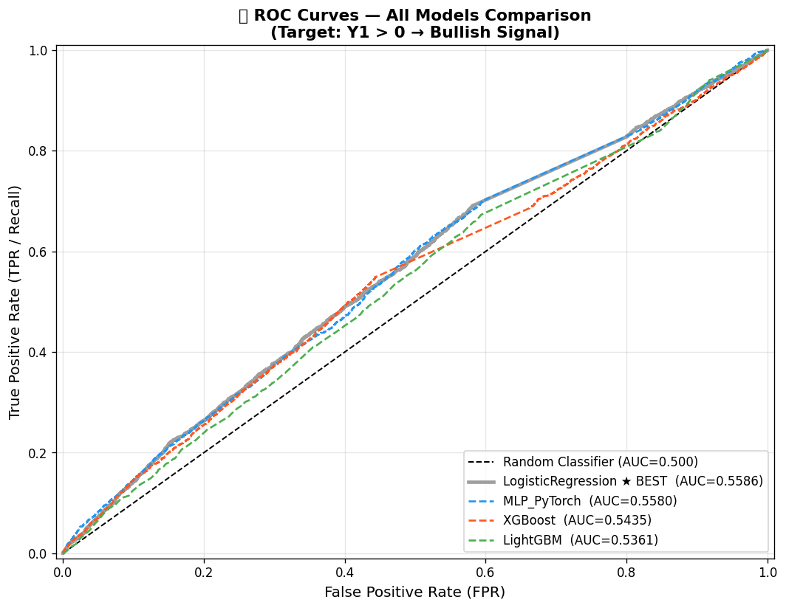
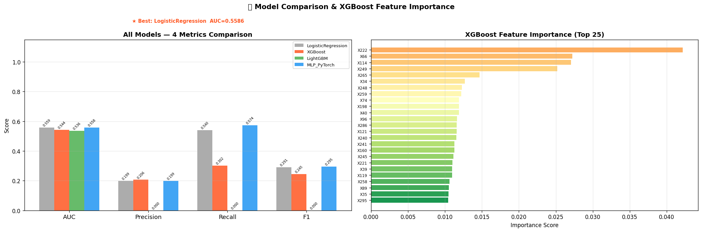
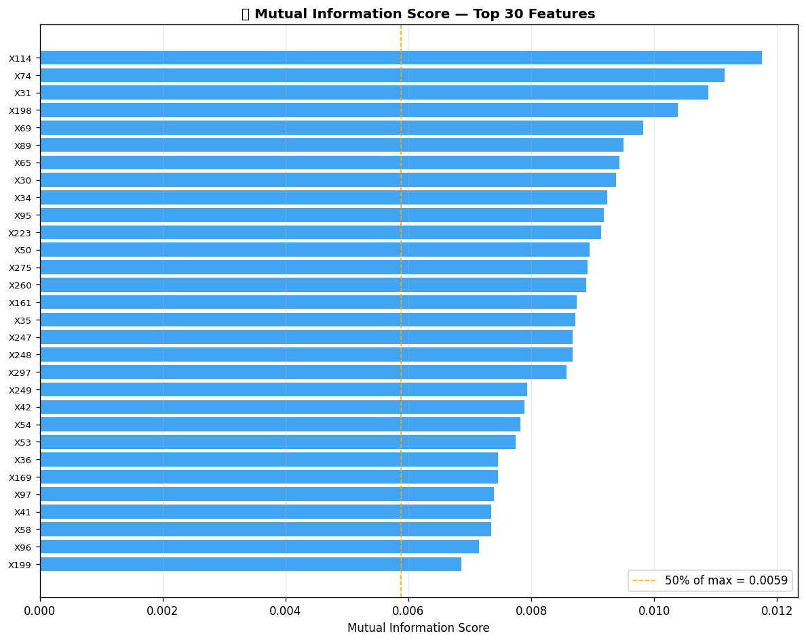
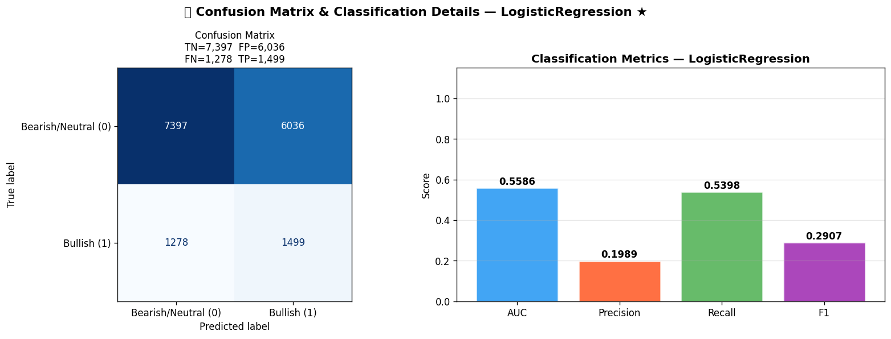

# Agent-Driven Financial Modeling System

> **LangChain ReAct Agent** for automated financial signal prediction.  
> Wraps the full ML pipeline—EDA → preprocessing → feature selection → multi-model training → evaluation—into composable LangChain Tools, orchestrated autonomously without any external LLM API.

---

## Demo Outputs

| ROC Curves | Model Comparison |
|:---:|:---:|
|  |  |

| Feature Importance (MI) | Confusion Matrix |
|:---:|:---:|
|  |  |

---

## Project Structure

```
Agent/
├── data.pq                    # Raw dataset (81,046 × 321)
└── Q2/
    ├── Q2.ipynb               # Main notebook (fully executed)
    ├── Q2.md                  # System design document
    ├── agent_code/
    │   ├── tools.py           # 6 LangChain @tool functions
    │   ├── models.py          # PyTorch MLP implementation
    │   ├── agent.py           # FinancialModelingAgent (ReAct orchestrator)
    │   └── visualizations.py  # Visualization helpers
    └── *.png                  # Auto-generated charts
```

---

## System Architecture

```
FinancialModelingAgent  (ReAct: Thought → Action → Observation)
│
├── Tool 1  tool_load_and_analyze     EDA, label distribution, missing rate
├── Tool 2  tool_preprocess           Temporal 80/20 split, median fill, StandardScaler
├── Tool 3  tool_check_data_leakage   Temporal ordering audit
├── Tool 4  tool_feature_selection    Variance filter → Mutual Information Top-100
├── Tool 5  tool_train_all_models     LR / XGBoost / LightGBM / MLP (PyTorch)
└── Tool 6  tool_evaluate_models      AUC / Precision / Recall / F1 ranking
```

State is shared across tools via a module-level `_STATE` dictionary (agent working memory), enabling stateful multi-step reasoning without an LLM API.

---

## Dataset

| Property | Value |
|---|---|
| Rows | 81,046 |
| Features | X1 – X300 (numeric, ~23% missing) |
| Labels | Y1 – Y12 (three-valued: −1 / 0 / +1) |
| Target | Y1 binarized: `Y1 == 1` → bullish signal |
| Positive rate | ~14.5% (class imbalance 1:6) |
| Time range | 2015-01-05 → 2020-12-31 |

---

## Pipeline Details

### Data Splitting (Anti-Leakage)

- Sort by `trade_date` → take first 80% as train, last 20% as test
- `StandardScaler` and median imputer fitted **on train set only**
- Automated leakage audit verifies strict temporal ordering

### Feature Selection

```
300 features
   → Variance filter (threshold = 0.01)
   → Mutual Information scoring (10,000-sample subsample)
   → Top-100 selected
```

### Models & Hyperparameters

| Model | Key Settings |
|---|---|
| Logistic Regression | `C=0.1`, `class_weight="balanced"`, `max_iter=1000` |
| XGBoost | `n_estimators=300`, `max_depth=5`, `lr=0.05`, `scale_pos_weight` auto |
| LightGBM | Same as XGBoost, `early_stopping(30)` |
| MLP (PyTorch) | `[256→128→64→1]`, BatchNorm, Dropout=0.3, Adam, 30 epochs |

---

## Results

| Model | AUC ↑ | Precision | Recall | F1 |
|---|---|---|---|---|
| **LogisticRegression ★** | **0.5586** | 0.1989 | 0.5398 | 0.2907 |
| MLP_PyTorch | 0.5580 | 0.1987 | 0.5736 | 0.2952 |
| XGBoost | 0.5435 | 0.2065 | 0.3018 | 0.2452 |
| LightGBM | 0.5361 | 0.0000 | 0.0000 | 0.0000 |

> AUC ~0.55 is expected on financial time-series data with very low signal-to-noise ratio. LightGBM defaults to predicting all-negative at threshold=0.5 due to class imbalance; lowering the threshold significantly improves its F1.

---

## Quick Start

```bash
# 1. Create virtual environment
python3 -m venv .venv
source .venv/bin/activate

# 2. Install dependencies
pip install pandas pyarrow scikit-learn xgboost lightgbm \
            torch --index-url https://download.pytorch.org/whl/cpu \
            langchain langchain-community matplotlib seaborn \
            jupyter ipykernel

# 3. Register kernel
python -m ipykernel install --user --name q2_venv --display-name "Python (Q2 venv)"

# 4. Open notebook
cd Q2
jupyter notebook Q2.ipynb
```

---

## Tech Stack

`Python 3.12` · `LangChain 1.2` · `PyTorch 2.10` · `XGBoost 3.2` · `LightGBM 4.6` · `scikit-learn 1.8` · `pandas 3.0` · `Jupyter`

---

## License

MIT
